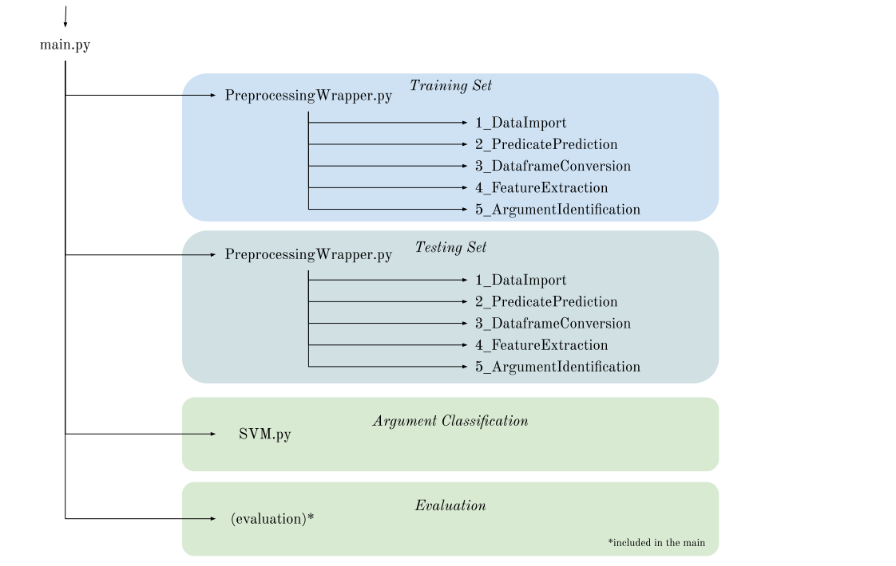

# Assignment 2, Semantic Role Labeling<br>


## Run SRL model

__Requirements__<br>
Plase make sure to have scikit-learn and spacy installed as well as standard packages like numpy and pandas.


__Input__<br>

- conll train file
- conll test file


__Output__

Main output containing overview on achieved precision / recall / f1-scores: <br>
- data/output/production_results.txt<br>


Other relevant outputs: <br>
- data/intermediate/production_train_05_identifiedArguments.csv <br>
// csv containing expanded data incl. predicate and argument identification predictions <br>
- data/output/production_06_predictedArguments.csv <br>
// csv containing predictions for predicates <br>

__Run train and testing of model__ <br><br>


The pipeline can be run with the provided test <br>

mode options: <br>
- production
- sample
- custom


<path_to_train> <path_to_test> only have to be set for custom. <br>
For production and sample mode, predefined paths are set (or can be amended) in the main.py file.<br>

```
cd part1
python main.py <mode> <path_to_train> <path_to_test>
```


The following execution plan provides an overview on the structure of the files and functions executed within the SRL model.



## Overview / Report

### The task<br>
This assignment focuses on semantic role labeling, which comes down to ‘teach’ a  machine to establish ‘who did what to whom and when, how, etc’.<br>

### The data<br>
All data (training, development and test) is provided in conllu files with a variable number of columns. However, the first 11 are always the same. These first columns contain the following data (names are taken from the example shown in class):<br>
* id – gives the position in the sentence<br>
* form – or token<br>
* lemma – the base form of the form<br>
* upos – the universal POS tag of the form<br>
* xpos –  the language-dependent POS tag of the form<br>
* morph – includes various information about the form, for instance its number (singular or plural), verb tense, person of the verb (1st, 2nd or 3rd) or voice (passive or active (if no information is given about voice))<br>
* head – refers back to the id of the form of which the current form is a direct dependent<br>
* dep – the dependency relation, for example root or nsubj (subject)<br>
* head_dep – combining the two previous columns and providing some information for compound/complex sentences<br>
* space – to indicate if a space follows the form<br>
* predicate – the predicate according to PropBank, the number indicates its sense and the PropBank for that sense determines which arguments it can have<br>
The number of columns which follow these first columns depend on and are equal to the number of predicates established in the sentence. It gives the predicate (labeled ‘V’) and its arguments (labeled ‘ARG*’). Therefore, there is one column for each predicate.<br>

## Part 1: The traditional approach<br>
The traditional approach consists of training a classifier to predict the arguments for each predicate in a sentence. We do this by classifying the so-called arguments and this consists of two main tasks:<br>
1. Predicate and argument identification<br>
2. Argument classification<br>
The first task – the identification of all predicates, and subsequently all arguments, within a sentence – is a prerequisite for the actual task of argument classification since arguments are only arguments in relation to a predicate. The second task – the argument classification – then is to predict which kind of argument (ARG0, ARG1, etc.) can be assigned to each predicted argument in a sentence in relation to one predicate. This is conducted for each predicate in a sentence and for all sentences. Since arguments refer to related semantic roles, we are able to infer semantic roles in sentences by applying this classification task.<br><br>

### ***Extract predicates and arguments based on the dependency structure***<br><br>
__Predicates Prediction__<br>
We extracted the predicates based on their universal POS-tag. We considered as possible predicates all verbs (i.e. all tokens in the dataset with the uPOS-tag ‘VERB’ or ‘AUX’). We are aware that by operating in this way we miss out on quite a number of nouns and adjectives which are considered by the gold data as predicates. This mainly applies to nominalized forms of verbs (examples of these in the training data are ‘killing’ in ‘This killing of a respected cleric will be causing us trouble for years to come’ or ‘equivalent’ in ‘The MoI in Iraq is equivalent to the US FBI [...]’.<br><br>
__Argument Identification__<br>
For our argument extraction we tried to find all arguments to our predicted predicates (excluding punctuation) by finding the dependency relation based on the conllu file. We did this by establishing the id of the predicate, and then finding the arguments by looking for the same number in the column indicating which word is the parent or head of that token (the ‘head’ column).<br>
Additionally to this first rule of using the head of the dependents, we also implemented two further simple rules, which exclude punctuation as well as other identified predicates from the set of identified arguments.<br> 
To find the arguments in sentences with multiple predicates, we duplicated the sentence n times, so as to be able to find the arguments per predicate. One challenge in this is that in some sentences arguments are arguments for different predicates, and only the first one is mentioned in the ‘head’ column.<br><br>

### ***Describe the classification task for argument classification***<br><br>
To elaborate on the semantic role, each argument has a role that depends on its relation to its predicate. In this way by considering the predicate’s dependency on its constituents, it is possible to identify the possible ARGs in a sentence and to establish their role. For this reason, linguistic information for each argument (including its predicates and constituents) is very important so as to extract the type of ARGs in a sentence.<br><br>

### ***Make a list of features to extract***<br><br>
*Added features*<br><br>
**Sentence identifier**<br>
Adding an identifier to indicate that tokens belong to a sentence, which allows us to go through the data sentence by sentence.<br><br>
**Active or passive sentence**<br>
By establishing whether a sentence is active or passive helps to decide what the type of an argument is. In an active sentence, the subject/the token before the verb usually is ARG0 (or agent), in a passive sentence this usually is classified as ARG1 (or theme).<br><br>
**Constituent grouping**<br>
Establishing the full constituent of a predicted predicate and argument allows the model to learn the representation of a specific phrase.<br><br> 
*Considered features that have not been implemented*<br><br>
**Shortest path length**<br>
The shortest path length of a token to its head was a potential feature. However, this shortest path only gave 1 as a value. This does not add any significant value, so this feature was removed. A graph was made of each sentence, and the shortest path length was calculated using the networkx library.<br><br>
**First/last POS tag of the constituent**<br>
Looking at the first and last POS tag of a constituent might indicate the phrase type, and also give information about the type of argument. If a constituent starts with a preposition and ends with a proper name, this would rather point to a location (ARGM-LOC), whereas a preposition and a noun could also be the instrument of a phrase.<br><br>
**Named entity**<br>
As mentioned in the Introduction to the CoNNL-2005 shared task on Semantic Role Labeling (Carreras et al. (2005)), quite a lot of participants used NEs as features. If you would state for an argument which type of named entity it contains, that could say something about the type of argument (a location would rather indicate an ARGM-LOC, whereas a person could be an agent (i.e. ARG0) or the goal.<br><br>
**Composite Back-off Features**<br>

According to Joshi and Penstein-Rose (n.d.), Composite Back-off Features were able to develop more generalizable performance on the system by backing off to the part-of-speech (PoS) tag of either the head word or the modifier word (but not both at the same time). h-bo, which replaces the head-word with its PoS tag while maintaining the modifier word and m-bo composite back-off features, which replaces the modifier word with its PoS tag while keeping the head word. As a result the feature(s)(h-bo and m-bo) includes a lexical component generated from one word and a PoS tag derived from the other, as well as the dependency relationship itself. In this way, for example, the head word gets more information about the phrase which leads the system to learn more about the head words’ structure better to be able to generalize over the whole dataset. Also, while using this feature for predicate and argument classification, rather than replacing the modifier, replacing the head-word would be more sensible, as predicates are more related to the head word than the constituents (modifiers). This feature was actually used for sentiment analysis, but since both sentiment analysis and SRL are sequential tasks, we also expect it to work for SRL as well. <br><br>

**Establishing parent and children**<br>
Defining the parent and children of each predicate/argument and its constituents will help to clarify the syntactic structure of the sentence, and therefore help to predict an argument.<br><br>
**Phrase type**<br>
Establishing the phrase type (i.e. VP, NP, PP) of a constituent would help in establishing its syntactic function and therefore its semantic, as this might be indicative of the argument type.<br><br>
*Features already present in conll file*<br><br>
**Position in the sentence**<br>
This feature might be indicative of the argument type, as English is an SVO (subject-verb-object) language, and the subject (ARG0 or possibly ARG1) usually is at the start of the sentence.<br><br>
**Token**<br>
The token itself, which is the basis for all NLP tasks.<br><br>
**Lemma**<br>
Establishing the lemma might help the model to establish a link between different expressions of the same word (for example, plural or singular or different tenses of a verb).<br><br>
**POS tags**<br>
Both the universal and language-specific POS tag may help the model in deciding on a specific role.<br><br>
**Morph**<br>
This consists of all kinds of information on verb tense, voice, number, which might aid the model in establishing relations between words.<br><br>
**Head/dep/head_dep**<br>
This information - and specifically the information in the dependency (dep) column - can be very useful for the classifier as it indicates the syntactic role of a token in a sentence (for instance ‘root’ or ‘subject’).<br><br>
**Predictions**<br>
The predicate and argument predictions are also included as features for our model, as they indicate which tokens should be looked at in identifying the argument class.<br><br>

### ***Select a machine learning algorithm***<br><br>
We have decided to use a Support Vector Machine (SVM). This was both based on previous experiences (in the NER task for Machine Learning for NLP, SVM performed slightly better than logistic regression). It is also based on the fact that in the Introduction to the CoNNL-2005 shared task on Semantic Role Labeling, Carreras et al. (2005) note that 8 of the participating teams used Maximum Entropy (ME) and 6 used an SVM (sometimes in combination or both). However, when looking at the averaged F1 scores on the combined test data (WSJ and Brown) for the various approaches (and only when it was the only approach used), it turns out that SVM does somewhat better than ME (73.215 vs. 71.797).<br><br>

Scikitklearn’s Support Vector Machine model was used for this task's argument classification. The train and test dictionaries are used as input. This is then vectorized, using DictVectorizer. Now, Scikitlearn’s LinearSVC(), with a linear kernel, and a max iteration of 10000 is applied. GridSearch finds the best parameters, so the parameter C (regularization), the loss function, and the parameter for tolerance, meaning when the system reaches the optimum.

### ***Generate training and test instances***<br><br>
Due to the considerable time all preprocessing steps require (especially the feature extraction using spacy to retrieve the constituents), we cut our datasets down to be able to run the code in a reasonable time.<br>
The created training instances are composed of the first 1000 sentences of the propbank train file, the test file contains the first 300 sentences of the respective file.<br><br>

### ***Train your classifier***<br><br>
For the training of the classifier our approach uses predicted arguments (system labels) based on the predicted predicates.<br><br>

### ***Test your classifier on the test instances***<br><br>
The test strategy underlying the following evaluations follows the same approach as our train approach and always considers predictions based on previous predictions, which means that errors from early rule based predictions are propagated to the evaluation of later steps in the pipeline.<br>
The general low level of the achieved results reflect the small amount of training and testing data taken into consideration as described in Section 5.<br>

__Results__<br>
Taken from (https://github.com/robert-luis/NLP_Tech_Assignment_2/blob/main/data/output/production_results.txt) <br>

Mode:production<br>
*Predicate Prediction ConfusionMatrix*<br>
```
              precision    recall  f1-score   support

       False      0.997     0.992     0.995     28727
        True      0.771     0.893     0.828       847

    accuracy                          0.989     29574
   macro avg      0.884     0.942     0.911     29574
weighted avg      0.990     0.989     0.990     29574
```
<br>


*Argument Identification ConfusionMatrix*<br>
```
              precision    recall  f1-score   support

       False      0.990     0.964     0.977     28306
        True      0.495     0.779     0.605      1268

    accuracy                          0.956     29574
   macro avg      0.742     0.872     0.791     29574
weighted avg      0.969     0.956     0.961     29574
```


*Argument Classification ConfusionMatrix*<br>
```
      Unnamed: 0  precision    recall  f1-score      support
0           ARG0   0.739274  0.945148  0.829630   237.000000
1           ARG1   0.790614  0.682243  0.732441   321.000000
2           ARG2   0.282051  0.141026  0.188034    78.000000
3           ARG3   0.000000  0.000000  0.000000    10.000000
4           ARG4   0.000000  0.000000  0.000000     6.000000
5       ARGM-ADJ   0.000000  0.000000  0.000000     0.000000
6       ARGM-ADV   0.512821  0.322581  0.396040    62.000000
7       ARGM-CAU   0.000000  0.000000  0.000000     4.000000
8       ARGM-COM   0.000000  0.000000  0.000000     4.000000
9       ARGM-DIR   1.000000  0.333333  0.500000     6.000000
10      ARGM-DIS   0.714286  0.454545  0.555556    22.000000
11      ARGM-EXT   0.000000  0.000000  0.000000     6.000000
12      ARGM-GOL   0.014925  0.250000  0.028169     4.000000
13      ARGM-LOC   0.000000  0.000000  0.000000    23.000000
14      ARGM-MNR   1.000000  0.045455  0.086957    22.000000
15      ARGM-NEG   0.948718  0.973684  0.961039    38.000000
16      ARGM-PRD   0.000000  0.000000  0.000000     3.000000
17      ARGM-PRP   0.000000  0.000000  0.000000     4.000000
18      ARGM-PRR   0.000000  0.000000  0.000000    14.000000
19      ARGM-TMP   0.772727  0.215190  0.336634    79.000000
20        C-ARG1   0.000000  0.000000  0.000000     6.000000
21        C-ARG2   0.000000  0.000000  0.000000     0.000000
22           C-V   0.000000  0.000000  0.000000     1.000000
23        R-ARG0   0.727273  0.842105  0.780488    19.000000
24        R-ARG1   0.200000  0.250000  0.222222     8.000000
25        R-ARG2   0.000000  0.000000  0.000000     0.000000
26    R-ARGM-CAU   0.000000  0.000000  0.000000     0.000000
27    R-ARGM-DIR   0.000000  0.000000  0.000000     0.000000
28    R-ARGM-LOC   1.000000  0.333333  0.500000     3.000000
29    R-ARGM-MNR   0.000000  0.000000  0.000000     8.000000
30    R-ARGM-TMP   0.000000  0.000000  0.000000     0.000000
31             _   0.951965  0.778571  0.856582   280.000000
32      accuracy   0.614353  0.614353  0.614353     0.614353
33     macro avg   0.301708  0.205225  0.217931  1268.000000
34  weighted avg   0.716584  0.614353  0.638224  1268.000000
```


Total Processing Time: 104.34 min.<br><br>


Some insights we gained from the made predictions are the following:<br>
* our system does not realise that there cannot be two ARG0s in one sentence<br>
* our system classifies almost all arguments that are not ARG0/1/2/3 etc as ARGM-LOC. This might have to do with our limited training set<br>
* the last sentence is passive, but unfortunately the dataset does not have 'Voice=Pass' for this verb, so our system did not pick that up<br>
* as our system classifies a person as an ARGM-LOC multiple times, using a named-entity classifier – which also indicates the type of named entity (i.e. PER) might help the system to avoid this classification<br><br>

<br><br><br>

## Part 2: The neural approach<br>
**DatasetReader**<br>
The DatasetReader takes the data as input, and changes the type of the input data in order to make instances that can be used in the project. In the srl_main.py file, the incoming data is a dictionary, and the data is divided into 2 datasets; the training_data and the validation_data. <br><br>
**Model**<br>
A model takes some instances as input, and outputs some labels. AllenNLP takes a text field as input, and outputs a label and determines the loss. AllenNLP is an open-source library for creating deep learning models for machine learning tasks. Here, the model should create some features for the instances and classify the features (as vectors) into a label. In AllenNLP, the text is first changed into token IDs. Then, these token IDs are changed into a vector, using embeddings. Afterwards, a sequence of vectors for each token is made into a single vector. At last, the labeling takes place on every instance.<br><br>
**Trainer**<br>
The trainer in AllenNLP, gives the input instances to Model.forward(), which is part of the training loop, which in srl_main is the run_training_loop function. The trainer makes everything 1 whole, it uses the model, optimizer, instance, data loader, etc. A vocabulary is built in the run_training_loop function, based on the training data and the development data.<br><br> 
**Predictor**<br>
A predictor takes JSON file as input, and also predicts classes in JSON. It is used to predict new instances. In the srl_main.py, there is a Semantic Role Labeler Predictor that takes the model as input, with a sentence, and tries to classify the arguments of the predicates in a sentence.<br> 

After the AllenNLP environment is created, the following command needs to be executed.

```
cd part2 
python main_part2.py
```

In main_part2.py, the training dataset of 2000 sentences is used as the path_to_file_train. This can be changed into ‘../data/input/srl_univprop_en.train.conll’ when the whole dataset is needed. Moreover, then path_to_file_train should also be changed into '../data/intermediate/neuralSRL_train.jsonl'  

In the conll_to_json.py file, only the path_to_file and path_to_output variables need to be changed in order to alter between the training set and the development set. For this purpose, the dataset of the development set is used as the training set and the development set itself. Since the training dataset consists of many instances, running this entire dataset was not considered to be time efficient. Therefore, the training set is reduced to only include 2000 sentences. This smaller dataset is then used as input for the conll_to_json.py, as well as the development set.<br> 
When the development dataset is used as input, the 2 example sentences are labeled as followed:<br> 

I am running away from here !<br> 
['I', 'am', 'running', 'away', 'from', 'here', '!']<br> 
VERB: am | ARGS: ['0', 'B-V', '0', '0', '0', '0', '0']<br> 
VERB: running | ARGS: ['B-ARG0', '0', 'B-V', '0', '0', '0', '0']<br><br> 
The paint and wheels looked like glass and the interior looked new !<br> 
['The', 'paint', 'and', 'wheels', 'looked', 'like', 'glass', 'and', 'the', 'interior', 'looked', 'new', '!']<br> 
VERB: looked | ARGS: ['0', '0', '0', 'B-ARG0', 'B-V', '0', 'B-ARG1', '0', '0', '0', '0', '0', '0']<br> 
VERB: looked | ARGS: ['0', '0', '0', '0', '0', '0', '0', '0', '0', '0', 'B-V', '0', '0']<br><br> 

As can be seen, the 2 example sentences contain verbs that are correctly labeled as predicates and their arguments. So, we can conclude that the preprocessing works well.<br> 

## References<br>
* Carreras.X., and Màrquez. L., (2005). Introduction to the CoNLL-2005 Shared Task: Semantic Role Labeling. In Proceedings of the Ninth Conference on Computational Natural Language Learning (CoNLL-2005), pages 152–164, Ann Arbor, Michigan. Association for Computational Linguistics.
* Joshi.M., and Penstein-Rosé. C., (2009). Generalizing Dependency Features for Opinion Mining. In Proceedings of the ACL-IJCNLP 2009 Conference Short Papers, pages 313–316, Suntec, Singapore. Association for Computational Linguistics. 
